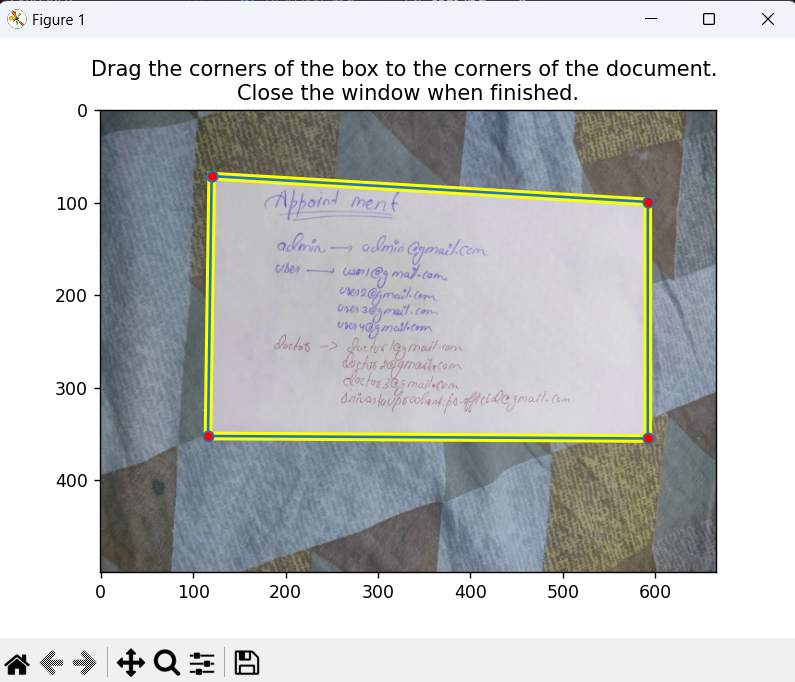

# Document Scanner

### An interactive document scanner built in Python using OpenCV

The scanner takes a poorly scanned image, finds the corners of the document, applies the perspective transformation to get a top-down view of the document, sharpens the image, and applies an adaptive color threshold to clean up the image.

#### Here are some examples of images before and after scan:


## Usage

### Without input

```
python scan.py (--images <IMG_DIR> | --image <IMG_PATH>) [-i]
```

- The `-i` flag enables interactive mode, where you will be prompted to click and drag the corners of the document. For example, to scan a single image with interactive mode enabled:```python scan.py --image uploads/sam.jpg -i```



- Alternatively, to scan all images in a directory without any input: 
```python scan.py --image uploads/sam.jpg```
check the output folder.

### With Inputs

Create a virtual environment:
```python -m venv <env-name>```
Activate the virtual environment:
```
cd <env-name>/Scripts
.\activate
cd ../..
```
Install the requirements:
```
pip install -r requirements.txt
```
Run the server :
```
python main.py
```

* Open index.html in a browser and ensure that the path to the server is correct.
* Select the image to upload and see the magic happen.